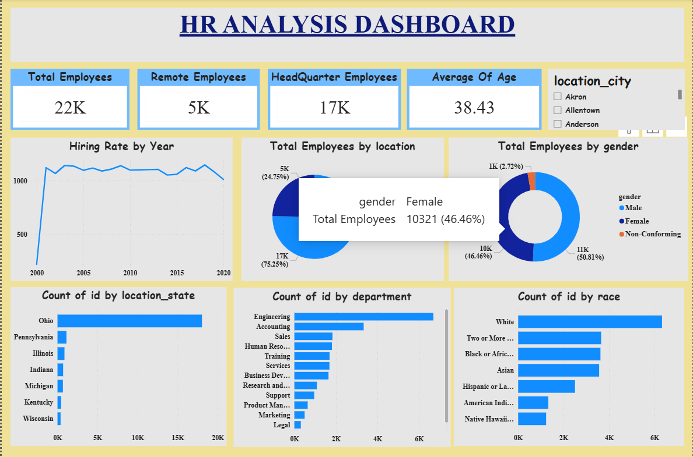
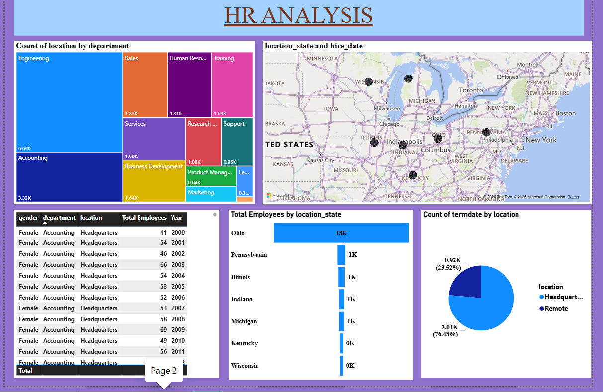

# 👨‍💼 HR Analytics Project

## Overview

The HR Analytics Project is a Power BI dashboard designed to analyze workforce data and provide actionable insights into employee demographics, attrition trends, job satisfaction, and organizational performance. The dashboard helps HR professionals and business leaders make data-driven decisions to improve employee retention, workforce planning, and overall organizational effectiveness.

This project demonstrates how HR data can be transformed into meaningful visualizations that support strategic human resource management.

---

## Business Problem

Employee attrition and workforce management are critical challenges for organizations. Understanding the factors influencing employee turnover and engagement is essential for improving retention and optimizing workforce performance.

This project addresses these challenges by:

- Monitoring employee attrition trends.
- Analyzing workforce demographics.
- Identifying key factors affecting employee retention.
- Supporting HR decision-making through data visualization.
- Providing insights for workforce planning and talent management.

---

## Project Objectives

- Analyze employee attrition and retention patterns.
- Monitor workforce demographics and distribution.
- Evaluate job satisfaction and employee engagement.
- Identify departments with high attrition rates.
- Support strategic HR decisions through interactive reporting.

---

## Tools & Technologies Used

- **Power BI Desktop**
- **Power Query**
- **DAX (Data Analysis Expressions)**
- **Data Modeling**
- **Microsoft PowerPoint**
- **Data Visualization**

---

## Key Performance Indicators (KPIs)

The dashboard tracks important HR metrics such as:

- Total Employees
- Active Employees
- Attrition Count
- Attrition Rate (%)
- Average Employee Age
- Average Monthly Income
- Job Satisfaction Score
- Department-wise Attrition

---

## Dashboard Features

### Workforce Overview
- Total Employee Count
- Gender Distribution
- Age Distribution
- Department-wise Employee Count

### Attrition Analysis
- Overall Attrition Rate
- Attrition by Department
- Attrition by Job Role
- Attrition by Age Group

### Employee Demographics
- Education Analysis
- Marital Status Distribution
- Gender Analysis
- Experience Distribution

### Job Satisfaction Analysis
- Satisfaction by Department
- Satisfaction by Job Role
- Employee Engagement Insights

### Interactive Dashboard
- Dynamic Filters
- Slicers
- Drill-Down Functionality
- Interactive Visualizations

---

## Dashboard Preview

### HR Dashboard Overview

### HR Dashboard Insights

---

## Project Files

| File Name | Description |
|------------|------------|
| HR Analysis project.pptx | Project presentation explaining dashboard and findings |
| Written Insights HR.docx | Detailed business insights and recommendations |
| hr-dashboard-overview.png.png | Dashboard overview screenshot |
| hr-dashboard-insights.png.png | Dashboard insights screenshot |
| README.md | Project documentation |

---

## Project Workflow

### 1. Data Collection
HR employee data was collected and prepared for analysis.

### 2. Data Cleaning & Transformation
Power Query was used to clean and transform the raw dataset.

### 3. Data Modeling
Relationships and data structures were created to support efficient reporting.

### 4. KPI Development
DAX measures were developed to calculate HR metrics and performance indicators.

### 5. Dashboard Design
Interactive reports and visualizations were created in Power BI.

### 6. Insight Generation
Workforce trends and attrition patterns were analyzed to generate actionable recommendations.

---

## Key Insights

The dashboard helps answer critical HR questions such as:

- What is the overall employee attrition rate?
- Which departments experience the highest turnover?
- How does attrition vary by age group and job role?
- What factors influence employee retention?
- Which employee segments require focused HR interventions?

---

## Business Impact

This project enables organizations to:

- Improve employee retention strategies.
- Identify high-risk attrition areas.
- Enhance workforce planning.
- Support talent management initiatives.
- Make data-driven HR decisions.

---

## Skills Demonstrated

- Data Cleaning & Transformation
- HR Analytics
- Data Modeling
- DAX Calculations
- Dashboard Development
- Data Visualization
- Business Intelligence Reporting
- Insight Generation

---

## Future Enhancements

- Employee Attrition Prediction using Machine Learning
- Employee Performance Analytics
- Workforce Forecasting
- Real-Time HR Dashboard Integration
- Predictive Workforce Planning

---

Aspiring Data Analyst | Power BI Developer

GitHub: https://github.com/nikhilkumarreddy84

---

## Conclusion

The HR Analytics Project demonstrates how business intelligence and data visualization can be leveraged to analyze workforce data, identify attrition patterns, and support strategic HR decision-making. The dashboard provides valuable insights that help organizations improve employee engagement, retention, and overall workforce effectiveness.
